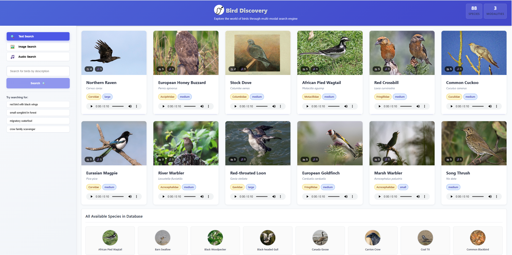
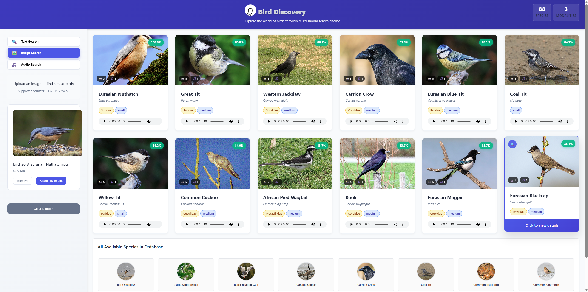

# Bird Discovery App

A multi-modal bird identification and discovery application that enables users to search for birds using text descriptions, images, or audio clips. Built with advanced vector search capabilities using Qdrant vector database.

## Demo Video

[\[Link to 1-minute demo video showcasing multi-modal bird search capabilities\]](https://youtu.be/XHOhdaS-uLU)

## Screenshots
   
   ### Homepage
   
   
   ### Search Results
   
   
## Quick Start

### Prerequisites
- Python 3.8+
- Node.js 14+
- Git

### Installation & Setup

1. **Clone the repository**
   ```bash
   git clone https://github.com/goalhunter/Birds_Discovery_Qdrant_Hackathon.git
   cd Birds_Discovery_Qdrant_Hackathon
   ```

2. **Set up environment variables**
   Create a `.env` file in the backend directory:
   ```env
   OPENAI_API_KEY=your_openai_api_key_here
   QDRANT_API_KEY=your_qdrant_api_key_here
   QDRANT_CLUSTER_ID=your_qdrant_cluster_id_here
   QDRANT_ENDPOINT=your_qdrant_endpoint_here
   ```

3. **Install backend dependencies**
   ```bash
   cd backend
   pip install -r requirements.txt
   ```

4. **Install frontend dependencies**
   ```bash
   cd ../frontend
   npm install
   ```

5. **Start the application**
   
   Backend (Terminal 1):
   ```bash
   cd backend
   python main.py
   # Runs on http://localhost:8000
   ```
   
   Frontend (Terminal 2):
   ```bash
   cd frontend
   npm start
   # Runs on http://localhost:3000
   ```

6. **Access the application**
   Open your browser and navigate to `http://localhost:3000`

## Features

### Multi-Modal Search
- **Text Search**: Describe bird characteristics (size, color, habitat, behavior)
- **Image Search**: Upload bird photos for visual identification
- **Audio Search**: Upload bird song recordings for acoustic identification

### Interactive Discovery
- **Random Bird Gallery**: Discover new species on the homepage
- **Cross-Modal Search**: Find similar birds across different media types
- **Detailed Bird Profiles**: Complete information with images, audio, and descriptions

### Search Capabilities
- Confidence scoring for search results
- Multiple media formats per bird (images, audio clips)
- Advanced vector similarity matching

## Technology Stack

### Frontend
- **React.js**: User interface framework
- **JavaScript/HTML/CSS**: Core web technologies

### Backend
- **FastAPI**: RESTful API framework
- **Python**: Core backend language

### AI & Machine Learning
- **OpenAI Text Embeddings**: Text feature extraction
- **ResNet50**: Image feature extraction (pre-trained)
- **Wav2Vec 2.0**: Audio feature extraction (pre-trained)

### Vector Database
- **Qdrant**: Vector similarity search and storage

### Data Processing
- **CrewAI**: Automated web scraping agents for images and text
- **Kaggle Dataset**: Original bird song audio data

## Project Structure

```
bird-discovery-app/
├── frontend/                 # React.js application
│   ├── src/
│   │   ├── components/       # React components
│   │   ├── services/         # API service layer
│   │   └── ...
│   ├── package.json
│   └── ...
├── backend/                  # FastAPI application
│   ├── main.py              # FastAPI server entry point
│   ├── requirements.txt     # Python dependencies
│   └── ...
├── clips_10sec/             # Processed 10-second audio clips
├── bird_images_wikimedia/   # Scraped bird images
├── metadata/                # Bird information JSON files
└── README.md
```

## Dataset Details

### Audio Data
- **Source**: Kaggle bird song dataset
- **Processing**: Extracted 10-second clips from longer recordings
- **Birds**: 88 unique species (IDs 0-87)
- **Format**: WAV files stored in `clips_10sec/`

### Image Data
- **Source**: Wikimedia Commons (via CrewAI scraping)
- **Count**: 5 images per bird species
- **Storage**: `bird_images_wikimedia/` directory

### Text Data
- **Source**: Wikipedia (via CrewAI scraping)
- **Content**: Species information, habitat, behavior, characteristics
- **Format**: JSON files in `metadata/` directory

## Data Processing Pipeline

### 1. Audio Processing
- Downloaded bird song dataset from Kaggle
- Cleaned and standardized audio clips to 10-second duration
- Extracted features using Wav2Vec 2.0 pre-trained model

### 2. Image Collection
- Used CrewAI agents to scrape 5 high-quality images per species from Wikimedia
- Processed images through ResNet50 for feature extraction

### 3. Text Information
- Automated Wikipedia scraping using CrewAI agents
- Extracted comprehensive bird information (habitat, size, behavior, etc.)
- Generated text embeddings using OpenAI's embedding model

### 4. Vector Storage
- All features (text, image, audio) stored in Qdrant vector database
- Optimized for fast similarity search across modalities

## API Endpoints

### Search Endpoints
- `POST /search/text`: Text-based bird search
- `POST /search/image`: Image-based bird identification
- `POST /search/audio`: Audio-based bird identification
- `GET /search/cross-modal/{bird_id}`: Find similar birds across modalities

### Data Endpoints
- `GET /birds/all`: Retrieve all bird species
- `GET /bird/{bird_id}`: Get specific bird information
- `GET /stats`: Database statistics

### Utility Endpoints
- `GET /`: Health check
- `GET /collections/status`: Vector database status

## Usage Examples

### Text Search
Search for birds by describing characteristics:
- "small red bird with black wings"
- "large water bird with long neck"
- "forest bird with melodious song"

### Image Search
Upload clear photos of birds for identification. Best results with:
- Good lighting and focus
- Bird clearly visible
- Minimal background clutter

### Audio Search
Upload bird song recordings for identification:
- Supported formats: WAV, MP3
- Clear audio with minimal background noise
- 10-second clips work best

## License

Created for educational and research purposes.